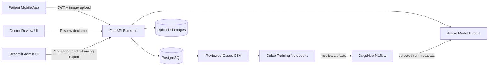
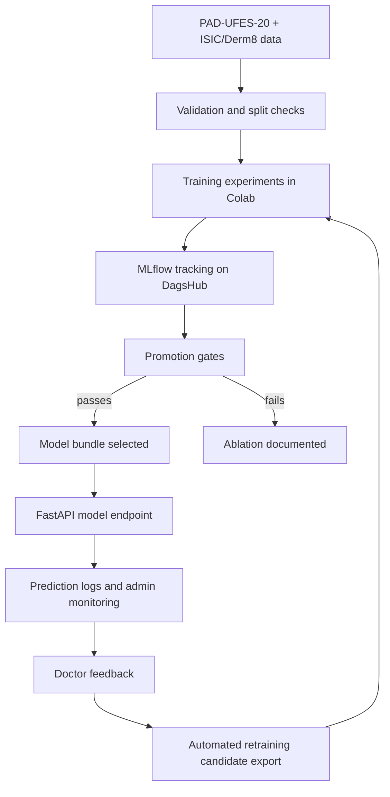
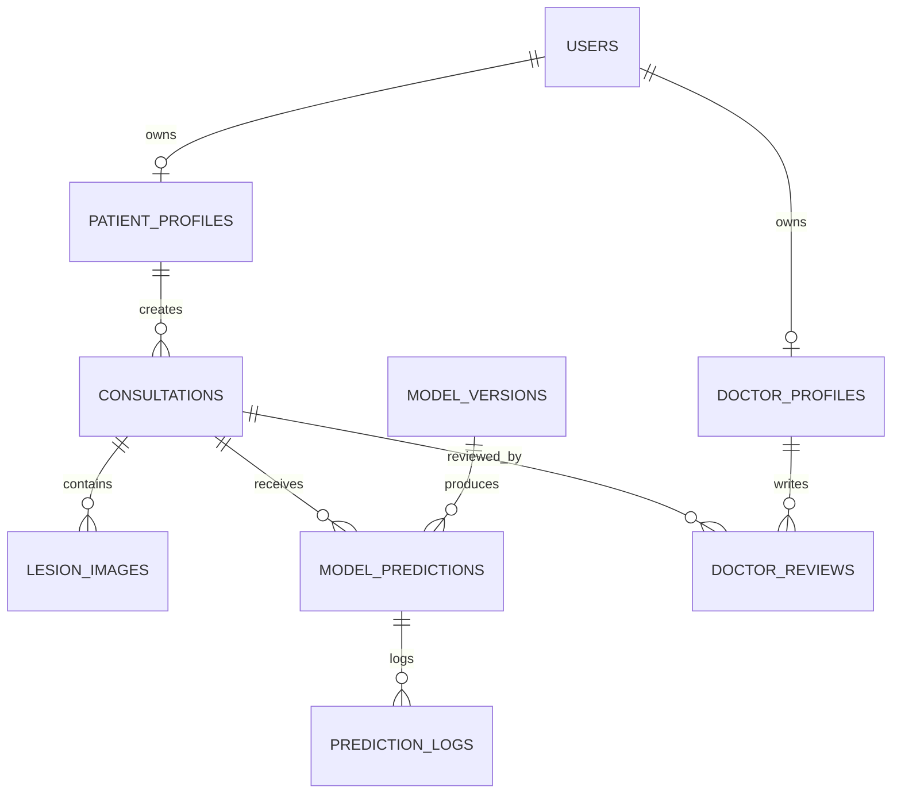

# Final Report And Demo Assets

This file gathers the diagrams, screenshot checklist, and report sections needed for the final presentation.

## Model Decision

The final selected model remains the PAD-UFES-20 multimodal EfficientNet-B0 model initialized from ISIC pretraining:

- Run ID: `ef084927bef741f996894b8a0fdd63e3`
- Macro F1: `0.6902`
- Balanced accuracy: `0.6804`
- High-risk recall: `0.8902`
- SCC recall limitation: `0.2069`

Class-aware augmentation failed the promotion gates. Derm8 improved SCC recall, but hurt macro F1, balanced accuracy, and high-risk recall enough that it should be reported as an ablation only.

## Architecture Diagram

## MLOps Lifecycle Diagram

## Database Schema Diagram

## Screenshot Checklist

- DagsHub MLflow experiment page showing the final run and ablation runs.
- FastAPI `/docs` with auth, patient, doctor, admin, monitoring, and model endpoints.
- Streamlit admin monitoring with metrics, alerts, recent predictions, and retraining candidates.
- Mobile patient flow: login, new case form, image preview, loading state, prediction result with probability bars.
- Doctor review flow: queue, lesion image preview, prediction probabilities, review submission.

## Mobile Demo Verification

Use [Run_mobile_app.md](../Run_mobile_app.md) for the physical-phone validation. The next run should explicitly verify:

- Expo starts in tunnel mode.
- `EXPO_PUBLIC_TELEDERM_API_URL` uses the localtunnel URL once, without a duplicated `https://`.
- Login works with `patient@example.com`.
- Gallery/camera upload succeeds through `expo-file-system/legacy`.
- The prediction screen shows the image preview, loading progress, risk badge, label, and probability bars.
- The submitted case appears in patient history and doctor review.

This repository update cannot physically validate the phone flow by itself; it prepares the app and runbook for that validation step.

## Final Report Sections

1. Dataset and preprocessing: PAD-UFES-20 structure, metadata normalization, split policy, ISIC/Derm8 mapping, leakage prevention.
2. Model experiments: image baseline, metadata baseline, multimodal fusion, ISIC pretraining, class-aware augmentation, Derm8 ablation, model selection gates.
3. MLOps pipeline: DVC/data versioning, Colab training notebooks, MLflow tracking on DagsHub, artifact handling, automated retraining workflow.
4. Deployment and backend: FastAPI, PostgreSQL schema, authentication, model bundle loading, patient/doctor/admin endpoints.
5. Monitoring and feedback loop: prediction logs, latency, label/risk counts, doctor reviews, retraining candidate export.
6. Limitations and ethics: decision support only, SCC weakness, dataset bias, skin tone coverage, clinician oversight, privacy/security.
7. Future work: more validated data, stronger SCC-focused training, focal loss/sampler ablations, calibration, deployment hardening.
